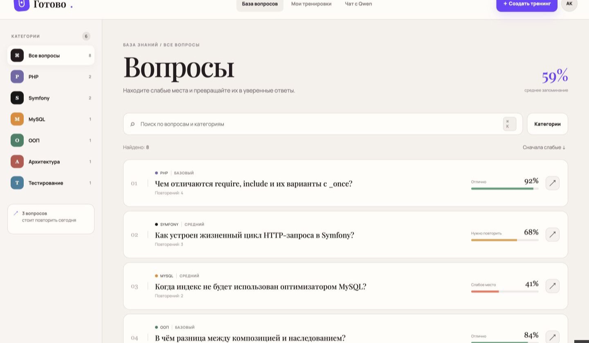
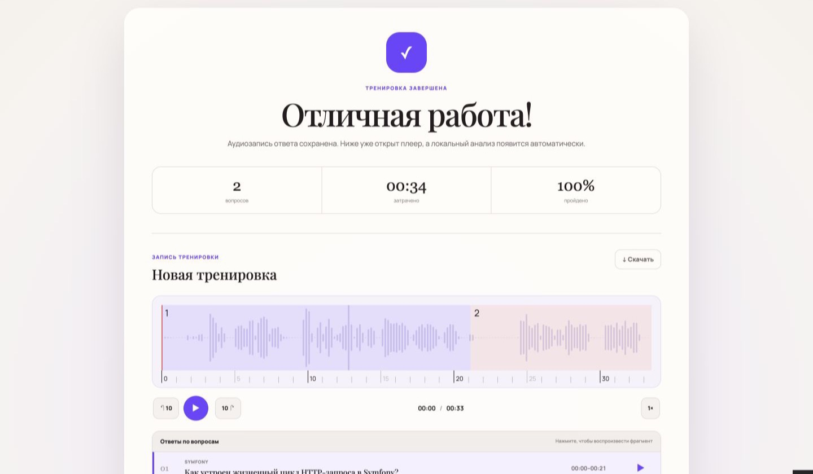
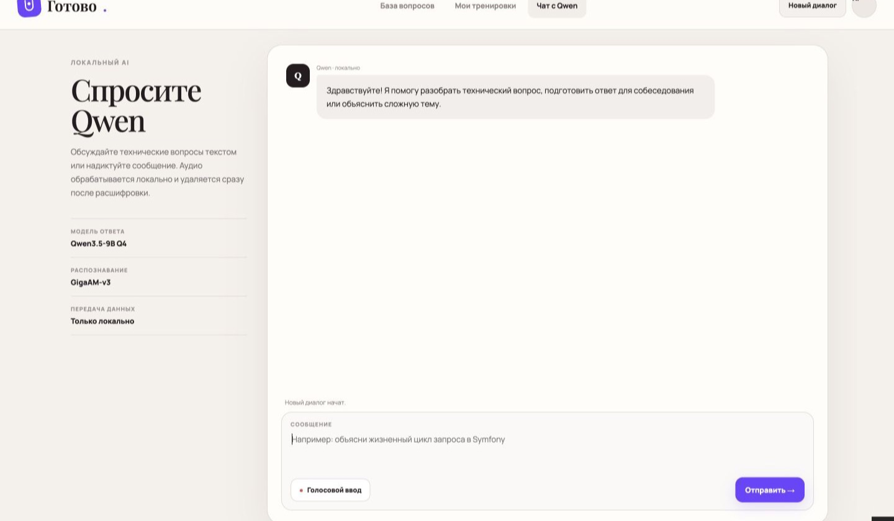

# Sobes Trainer

[English](README.en.md) · Русский

Локальный ИИ-тренер технических собеседований. Sobes Trainer записывает только голос, расшифровывает ответы с помощью GigaAM, оценивает их локальной Qwen и показывает разбор вместе с таймкодами исходной записи.

Проект рассчитан прежде всего на самостоятельное использование на Mac с Apple Silicon. Он не отправляет записи, расшифровки или ответы во внешние платные API.

## Интерфейс

### База вопросов



### Результат и аудиоплеер



### Локальный чат с Qwen и голосовым вводом



## Почему Sobes Trainer

- **Приватность по умолчанию.** Аудио, расшифровки и оценки остаются на компьютере пользователя.
- **Без оплаты за API.** GigaAM и Qwen запускаются локально.
- **Тренировка реальной речи.** Приложение анализирует не только содержание, но также паузы, темп и слова-паразиты.
- **Разбор по каждому вопросу.** Общая запись размечается таймкодами; нужный ответ можно сразу выбрать на волновой форме WaveSurfer.js.
- **Практические рекомендации.** Qwen возвращает структурированную оценку по семи критериям, сильные стороны, пропущенные темы и следующие шаги.
- **Экономное использование памяти.** Сначала работает GigaAM, затем он выгружается и только после этого запускается Qwen. Обе модели не удерживаются в памяти одновременно.
- **Устойчивость локальных моделей.** Потоковый ответ проверяется на повторения и зацикливание; предусмотрены таймауты, до трёх попыток и понятные ошибки в интерфейсе.
- **Заменяемые модели.** ASR и оценка скрыты за интерфейсами адаптеров, поэтому стек можно поменять без переделки пользовательского сценария и базы данных.
- **Встроенный локальный чат.** С Qwen можно общаться текстом или надиктовать запрос через GigaAM.

## Возможности

- каталог вопросов с категориями, сложностью и прогрессом;
- конструктор и сохранение собственных тренировок;
- непрерывная аудиозапись всей попытки без камеры и видео;
- вопросы, таймер и управление прохождением с клавиатуры;
- открытый плеер результата с волновой формой, скоростью воспроизведения и таймкодами вопросов;
- русская расшифровка GigaAM-v3 `v3_e2e_rnnt` со словами, паузами и речевыми метриками;
- локальная оценка Qwen3.5-9B в 4-bit-квантизации через Ollama;
- повторный анализ из сохранённой расшифровки без повторного запуска ASR;
- отдельная страница локального чата с текстовым и голосовым вводом.

## Стек

- Symfony 7.4, PHP 8.4, Twig;
- PostgreSQL 17, Doctrine ORM;
- Redis и Symfony Messenger;
- обычные JavaScript и CSS без отдельного frontend-backend;
- WaveSurfer.js 7.x;
- FastAPI, GigaAM-v3 и FFmpeg;
- Ollama и Qwen3.5-9B Q4;
- Docker Compose и Nginx.

## Требования

- macOS с Apple Silicon;
- Docker Desktop;
- Homebrew;
- не менее 16 ГБ объединённой памяти, рекомендуется 24 ГБ;
- свободное место для Docker-образов, Python-окружения и весов моделей.

Проект проверен на MacBook Air M4 с 24 ГБ памяти. GigaAM умеет откатываться с MPS на CPU, но скорость на другом оборудовании может отличаться.

## Быстрый запуск

Клонируйте репозиторий и выполните одну команду:

~~~bash
git clone https://github.com/albert-mukhametshin/sobes-trainer.git
cd sobes-trainer
./bin/sobes
~~~

Скрипт:

- проверит Homebrew и Docker Desktop;
- установит отсутствующие **ffmpeg**, **uv** и **ollama**;
- создаст локальный **.env** со случайными секретами;
- подготовит Python-окружение GigaAM и загрузит Qwen;
- запустит Ollama, GigaAM и Docker-сервисы;
- применит миграции и проверит доступность приложения.

Повторный запуск безопасен: уже работающие сервисы и загруженные модели переиспользуются.

Управление локальным стеком:

~~~bash
./bin/sobes status
./bin/sobes logs
./bin/sobes restart
./bin/sobes stop
~~~

Те же основные команды доступны как **make start**, **make status** и **make stop**.

После запуска доступны:

- приложение: [http://localhost:8080](http://localhost:8080);
- локальный чат: [http://localhost:8080/chat](http://localhost:8080/chat);
- Mailpit: [http://localhost:8025](http://localhost:8025);
- проверка состояния: [http://localhost:8080/health](http://localhost:8080/health).

Первое распознавание загружает веса GigaAM в пользовательский кеш и поэтому выполняется дольше обычного.

Для ручного запуска отдельных компонентов по-прежнему доступны цели **make ai-ollama**, **make ai-asr**, **make up** и **make db-migrate**.

## Как работает анализ

```text
аудио
  ↓
GigaAM-v3 e2e_rnnt
  ↓ расшифровка, слова, паузы и речевые метрики
выгрузка GigaAM
  ↓
Qwen3.5-9B Q4 через Ollama
  ↓ структурированная оценка и рекомендации
выгрузка Qwen
```

После завершения тренировки задача анализа передаётся Symfony Messenger. Готовые расшифровки и оценки переиспользуются при повторном запуске, если модель не менялась. Это позволяет продолжить прерванный анализ без повторной обработки аудио.

## Голосовой ввод в чате

Пользователь явно включает микрофон, записывает сообщение и останавливает запись. Временный файл передаётся GigaAM и удаляется после распознавания даже при ошибке. Полученный текст появляется в поле ввода: его можно проверить и только затем отправить Qwen.

История чата хранится только в памяти открытой вкладки и не записывается в PostgreSQL.

## Данные и приватность

- Камера, демонстрация экрана и видео не запрашиваются.
- Записи тренировок хранятся в `var/audio`, вне публичной директории.
- Доступ к аудио осуществляется через контролируемые Symfony-маршруты.
- Серверные пути не возвращаются в API.
- Голосовые сообщения чата удаляются сразу после расшифровки.
- Внешние платные AI API не используются.

Схема таблиц и точные правила хранения описаны в [docs/data-model.md](docs/data-model.md).

## Команды разработчика

```bash
make test
make lint
docker compose exec php php bin/console doctrine:schema:validate
```

Инструкции локального AI-сервиса находятся в [local-ai/README.md](local-ai/README.md). Продуктовые ограничения описаны в [interview-trainer-project-description.md](interview-trainer-project-description.md).

## Лицензия

Sobes Trainer распространяется на условиях [GNU General Public License v3.0](LICENSE).
